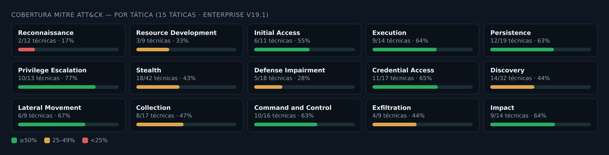
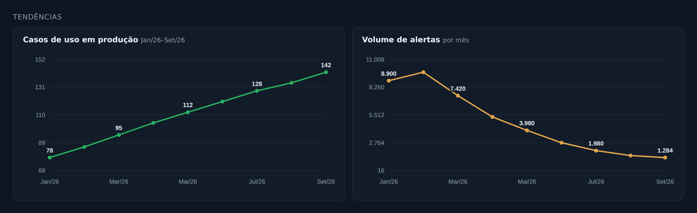

# SOC KPI & MITRE ATT&CK Coverage Dashboard

Dashboard operacional de SOC/CSIRT servido como **Google Apps Script Web App**, com **cobertura MITRE ATT&CK ao vivo do Elastic Security** e **KPIs operacionais** lidos de uma planilha Google. Um único app, um único link, atualização automática por cache + gatilhos de tempo, controle de acesso por lista/grupo e **fluxo de solicitação/aprovação de acesso** por e-mail.

> Stack: Google Apps Script (HtmlService, CacheService, PropertiesService, MailApp, LockService) · Elastic Security Detection Engine API (Kibana) · MITRE ATT&CK Enterprise v19.1 (15 táticas).

## Telas


*Matriz ATT&CK — 15 táticas, técnicas coloridas por cobertura, casos do mês destacados.*


*KPIs operacionais com padrão de cores semântico e destaques gerados por mês.*






*E-mail de aprovação de acesso (Aprovar / Reprovar).*

> Imagens ilustrativas com dados fictícios.

---

## Sumário

- [Arquitetura](#arquitetura)
- [Funcionalidades](#funcionalidades)
- [Estrutura do projeto](#estrutura-do-projeto)
- [Pré-requisitos](#pré-requisitos)
- [Configuração](#configuração)
  - [1. Propriedades do script](#1-propriedades-do-script)
  - [2. Escopos OAuth (manifesto)](#2-escopos-oauth-manifesto)
  - [3. Autorização](#3-autorização)
  - [4. Implantação](#4-implantação)
  - [5. Gatilhos de atualização](#5-gatilhos-de-atualização)
- [Controle de acesso](#controle-de-acesso)
- [Fluxo de solicitação/aprovação](#fluxo-de-solicitaçãoaprovação)
- [Cache versionado](#cache-versionado)
- [Modelo de dados da planilha](#modelo-de-dados-da-planilha)
- [Operação e manutenção](#operação-e-manutenção)
- [Segurança](#segurança)
- [Roadmap](#roadmap)
- [Licença](#licença)

---

## Arquitetura

```
                    ┌────────────────────────────────────────────┐
                    │            Google Apps Script               │
   Navegador  ──►   │  doGet() ──► HtmlService (Index.html)        │
   (/exec)          │     │                                        │
                    │     ├─ getCoverage()  ──► Kibana Detection    │  HTTPS  ┌───────────┐
                    │     │        │              Engine API  ──────┼────────►│  Elastic  │
                    │     │        └─ CacheService (chunked, 30min) │         │  Security │
                    │     │                                        │         └───────────┘
                    │     └─ getOperational() ─► SpreadsheetApp ────┼──┐
                    │              └─ CacheService (chunked, 2h)    │  │      ┌───────────┐
                    │                                              │  └─────►│  Google   │
                    │  Time triggers: refreshCache / refreshOper   │         │  Sheet    │
                    └────────────────────────────────────────────┘         └───────────┘
```

- **Frontend** (`Index.html`): SPA de arquivo único (HTML/CSS/JS inline). Busca dados via `google.script.run` de forma assíncrona; renderiza a matriz ATT&CK, KPIs, gráficos SVG inline e destaques automáticos.
- **Backend** (`Code.gs`): busca regras do Elastic (paginado), calcula cobertura contra o catálogo ATT&CK embutido, lê a planilha operacional, serve o HTML e cuida de acesso/aprovação.
- **Execução como o proprietário** (`USER_DEPLOYING`): a credencial do Elastic e o acesso à planilha ficam centralizados no dono do script; os visitantes só recebem o HTML renderizado.

---

## Funcionalidades

**Cobertura MITRE ATT&CK (ao vivo)**
- Matriz das 15 táticas (Enterprise v19.1), técnicas e subtécnicas, com status coberta / parcial / sem cobertura.
- Mapeia regras de detecção do Elastic para técnicas/subtécnicas via campo `threat`.
- "Casos criados no mês" = regras **custom** (autorais, `immutable:false`) criadas no mês corrente (fuso local), ignorando as regras prebuilt do catálogo.
- Resumo por tática, gaps priorizados e detalhe dos casos do mês.

**KPIs operacionais (planilha)**
- Casos em produção, alertas por mês, consumo de licença (ECU), inventário SIEM × CMDB, casos por tecnologia, criticidade.
- Seletor de período (mês) filtrado ao ciclo do ano vigente.
- **Destaques automáticos por mês**: alertas vs mês anterior, licença (saudável/atenção/estouro), maior gap de inventário — derivados dos próprios dados.
- **Padrão de cores semântico** nos KPIs (verde / âmbar / vermelho / azul informativo) com thresholds parametrizáveis.
- Gráficos de linha com rótulo de valor mês a mês e semáforo de licença.

**Plataforma**
- **Um único web app** (MITRE + operacional na mesma URL).
- **Cache versionado** — evita que versões diferentes de código "briguem" pelo mesmo cache.
- **Controle de acesso** por lista de e-mails ou grupo do Google.
- **Solicitação/aprovação de acesso** por e-mail com botões, sem editar código.

---

## Estrutura do projeto

```
.
├── Code.gs            # Backend: Elastic fetch, cobertura ATT&CK, planilha, acesso, aprovação
├── Index.html         # Frontend: SPA (renomeado para "Index" dentro do Apps Script)
├── appsscript.json    # Manifesto: escopos OAuth + config do web app
└── README.md
```

No editor do Apps Script você terá **exatamente 2 arquivos**: `Code.gs` e um HTML chamado `Index`. (O manifesto `appsscript.json` aparece ao habilitar "Mostrar arquivo de manifesto".)

---

## Pré-requisitos

- Conta Google Workspace (para deploy restrito ao domínio e uso de grupos).
- Acesso ao Kibana com uma **API key** de leitura das regras de detecção (Security).
- Uma **Planilha Google** (nativa, não `.xlsx`) com as abas do modelo de dados abaixo.

---

## Configuração

### 1. Propriedades do script

`Configurações do projeto → Propriedades do script`:

| Chave | Exemplo | Descrição |
|---|---|---|
| `KIBANA_URL` | `https://kibana.exemplo:5601` | Base do Kibana, **sem** barra final. |
| `ES_API_KEY` | `<base64 de id:api_key>` | API key do Elastic (valor codificado). |
| `KIBANA_SPACE` | `default` | Space do Kibana (opcional). |
| `SHEET_ID` | `1AbC...XyZ` | ID da Planilha Google operacional. |
| `ALLOWED_EMAILS` | `a@exemplo.com,b@exemplo.com` | Lista de acesso (opcional). |
| `ALLOWED_GROUP` | `soc-painel@exemplo.com` | Grupo com acesso (opcional, alternativa à lista). |
| `APPROVER_EMAILS` | `lead@exemplo.com` | Quem aprova solicitações (opcional; default = `ALLOWED_EMAILS`). |

> Propriedades são lidas em **runtime** — mudar lista/aprovadores **não** exige nova implantação.

### 2. Escopos OAuth (manifesto)

`appsscript.json`:

```json
{
  "timeZone": "America/Sao_Paulo",
  "webapp": { "executeAs": "USER_DEPLOYING", "access": "DOMAIN" },
  "runtimeVersion": "V8",
  "oauthScopes": [
    "https://www.googleapis.com/auth/spreadsheets",
    "https://www.googleapis.com/auth/script.external_request",
    "https://www.googleapis.com/auth/userinfo.email",
    "https://www.googleapis.com/auth/script.scriptapp",
    "https://www.googleapis.com/auth/groups",
    "https://www.googleapis.com/auth/script.send_mail"
  ]
}
```

- `executeAs: USER_DEPLOYING` → executa como o dono (credenciais centralizadas).
- `access: DOMAIN` → só usuários do mesmo domínio; o filtro fino fica no `isAuthorized_()`.

### 3. Autorização

No editor, selecione uma função que use cada escopo (ex.: `refreshCache` para UrlFetch, `refreshOperational` para Spreadsheet) e **Executar** → **Revisar permissões** → autorize com a conta do dono. Necessário uma vez após adicionar escopos novos.

### 4. Implantação

`Implantar → Nova implantação → App da Web`:
- **Executar como:** Eu
- **Quem tem acesso:** Qualquer pessoa na organização

Copie a URL `/exec`. **Para publicar mudanças de código, sempre use `Gerenciar implantações → Editar → Nova versão`** — não crie novas implantações (isso gera URLs duplicadas).

### 5. Gatilhos de atualização

`Gatilhos (ícone de relógio) → Adicionar gatilho`:

| Função | Frequência sugerida |
|---|---|
| `refreshCache` | a cada 30 min – 6 h (cobertura MITRE) |
| `refreshOperational` | a cada 2 h (KPIs da planilha) |

Cada visita lê o cache (rápido); os gatilhos reaquecem em background.

---

## Controle de acesso

`isAuthorized_()` decide o acesso em runtime:

- Sem `ALLOWED_EMAILS` **e** sem `ALLOWED_GROUP` → liberado para todo o domínio (evita trancar sozinho).
- Com lista/grupo → compara `Session.getActiveUser().getEmail()` (normalizado: minúsculas, trim, sem caracteres invisíveis de colagem) contra a lista, ou verifica associação via `GroupsApp.hasUser`.

**Recomendação enterprise:** use `ALLOWED_GROUP`. A verificação é por associação real no diretório (imune a ponto/alias/grafia), e a gestão de acesso vira entrada/saída do grupo — sem tocar no script.

Endpoint de diagnóstico: `…/exec?whoami=1` mostra o e-mail visto pelo app e o resultado de `isAuthorized_()`.

---

## Fluxo de solicitação/aprovação

1. Um usuário sem acesso vê a tela de bloqueio com o botão **Solicitar acesso** (com campo de justificativa).
2. `requestAccess()` registra a pendência (`PENDING_REQUESTS`, via `LockService`) e envia e-mail HTML ao(s) aprovador(es) com botões **Aprovar** / **Reprovar**.
3. O aprovador clica → `doGet(?approve|?deny=<token>)`:
   - Valida que quem clicou é aprovador (`Session.getActiveUser()` ∈ `APPROVER_EMAILS`) — token sozinho não basta.
   - Aprovar → adiciona o e-mail ao `ALLOWED_EMAILS` (runtime, sem redeploy) e notifica o solicitante.
   - Token é de **uso único**; escrita da lista sob `LockService`.

---

## Cache versionado

O resultado da cobertura carrega um carimbo `CODE_VERSION`, e a chave de cache é derivada dele (`coverage_<versão>`). O leitor **só aceita** cache da versão corrente; qualquer resíduo de versão anterior é ignorado e recalculado. Isso elimina o clássico "o número pisca" quando código novo e antigo compartilham cache durante um rollout. O build aparece no rodapé do painel para confirmação visual do que está no ar.

---

## Modelo de dados da planilha

Planilha Google (nativa) com as abas:

| Aba | Colunas (linha 1 = cabeçalho) |
|---|---|
| `Elastic` | Mês (data) · Produção · Homologação · Ajustes · … |
| `Casos de uso por tecnologia` | Mês (data) · <uma coluna por tecnologia> |
| `Casos de uso em Prod` | (série mensal de casos em produção) |
| `Alertas` | Mês (data) · <colunas por regra/uso> |
| `Origem do Log` | Fonte · Atual · Anterior |
| `Inventário SIEM` | Plataforma · SIEM · CMDB |
| `Licenciamento` | Mês (data) · Teto (ECU) · Consumo (ECU) |
| `Highlights` | Mês (data) · Melhorias · Próximas ações |

> Datas devem ser células de **data** de verdade (não texto), para o parser reconhecer o mês.

---

## Operação e manutenção

- **Mudou `Code.gs` ou `Index`** → publique **Nova versão**.
- **Mudou só uma propriedade** (lista, SHEET_ID, API key) → aplica em runtime, sem redeploy.
- **Uma única implantação** — arquive as demais (`Gerenciar implantações → ⋮ → Arquivar`) para não poluir e não confundir URLs.
- **Atualizar catálogo ATT&CK** — regenere o bloco `CATALOG` no `Code.gs` a partir do STIX oficial quando sair uma versão nova do framework.

---

## Segurança

- Credenciais (API key do Elastic) e `SHEET_ID` ficam **apenas** nas Propriedades do script — nunca no HTML nem versionados.
- `.gitignore` deve excluir qualquer arquivo de credencial. **Não** faça commit de API keys.
- Execução como proprietário: visitantes não recebem token nem tocam a planilha/Elastic.
- Aprovação de acesso exige identidade de aprovador + token de uso único, sob lock.
- Deploy restrito ao domínio (`access: DOMAIN`).

---

## Roadmap

- Inventário por mês (série temporal) para o card de gap acompanhar o período selecionado.
- Critério de "caso do mês" por tag de ciclo (`ciclo:AAAA-MM`) além de `created_at`.
- Exportação de snapshot (PDF/CSV) do ciclo.
- Métricas de MTTA/MTTR se disponíveis na fonte.

---

## Licença

MIT. Sinta-se livre para adaptar ao seu ambiente. Catálogo MITRE ATT&CK® é marca da The MITRE Corporation; uso conforme os termos do framework.
