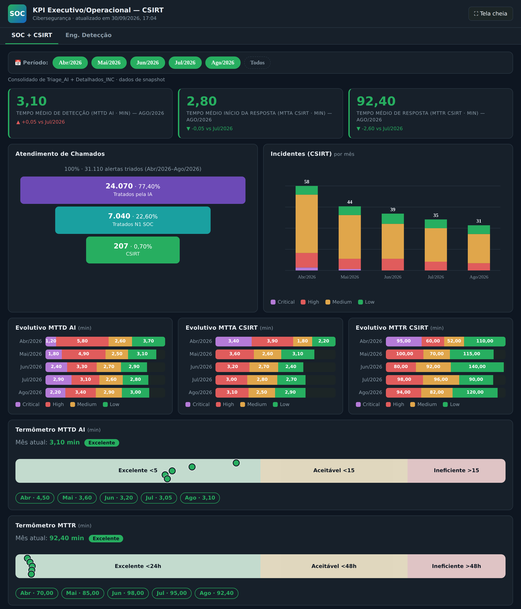
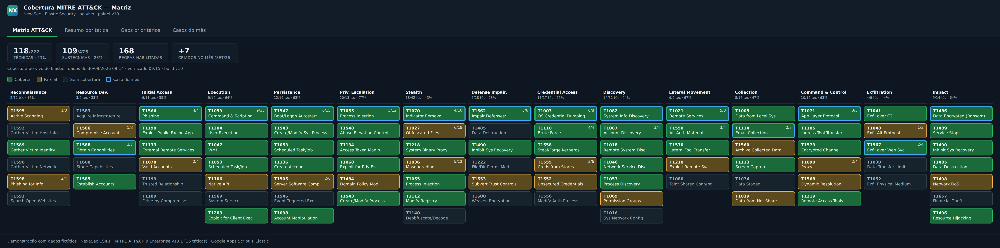
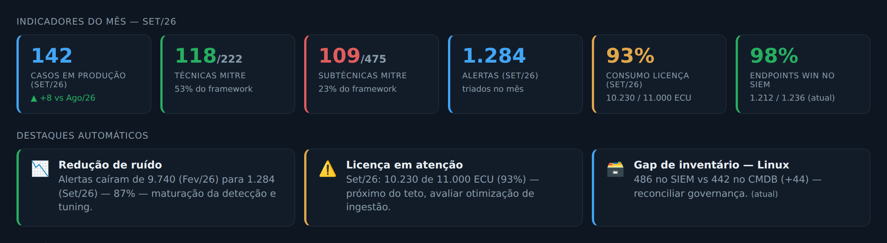
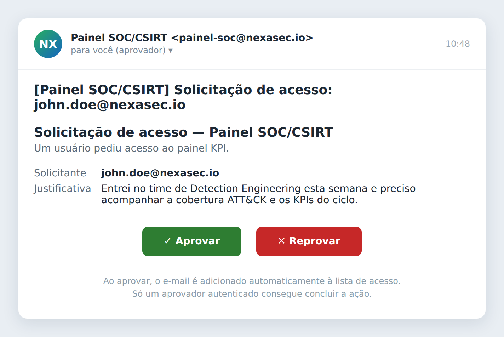

# SOC/CSIRT KPI & MITRE ATT&CK Coverage Dashboard

Painel **executivo/operacional de SOC/CSIRT** servido como **Google Apps Script Web App**. Reúne, em um único link:

- **SOC + CSIRT** — KPIs de resposta a incidentes (MTTD, MTTA, MTTR), funil de atendimento (IA → N1 → CSIRT), incidentes por mês/severidade, evolutivos, termômetros de SLA e pontos-chave/atenção gerados automaticamente.
- **Eng. Detecção** — KPIs operacionais de SIEM, alertas, capacidade/ativos e **cobertura MITRE ATT&CK ao vivo do Elastic Security**.

Atualização automática por cache + gatilhos de tempo, controle de acesso por lista/grupo e **fluxo de solicitação/aprovação de acesso** por e-mail (botões Aprovar/Reprovar).

> Stack: Google Apps Script (HtmlService, CacheService, PropertiesService, MailApp, LockService, SpreadsheetApp) · Elastic Security Detection Engine API (Kibana) · Google Sheets · MITRE ATT&CK Enterprise v19.1 (15 táticas).

## Telas


*Aba SOC + CSIRT — KPIs de MTTD/MTTA/MTTR com variação vs mês anterior, funil de atendimento, incidentes por severidade, evolutivos, termômetros de SLA e seletor de período multi-mês.*


*Eng. Detecção → Cobertura MITRE — 15 táticas, técnicas coloridas por cobertura, casos do mês destacados.*


*Eng. Detecção → Visão geral — KPIs operacionais com padrão de cores semântico e destaques por mês.*


*E-mail de aprovação de acesso (Aprovar / Reprovar).*

> Imagens ilustrativas com dados fictícios.

---

## Sumário

- [Arquitetura](#arquitetura)
- [Navegação](#navegação)
- [Funcionalidades](#funcionalidades)
- [Métricas (definições)](#métricas-definições)
- [Estrutura do projeto](#estrutura-do-projeto)
- [Pré-requisitos](#pré-requisitos)
- [Configuração](#configuração)
- [Controle de acesso](#controle-de-acesso)
- [Fluxo de solicitação/aprovação](#fluxo-de-solicitaçãoaprovação)
- [Cache versionado](#cache-versionado)
- [Modelo de dados](#modelo-de-dados)
- [Operação e manutenção](#operação-e-manutenção)
- [Segurança](#segurança)
- [Licença](#licença)

---

## Arquitetura

```
                     ┌───────────────────────────────────────────────┐
                     │              Google Apps Script                │
   Navegador  ──►    │  doGet() ──► HtmlService (Index.html)          │
   (/exec)           │     │                                          │
                     │     ├─ getCsirt()       ─► SpreadsheetApp ──────┼─┐ Triage_AI + Detalhados_INC
                     │     │        └─ CacheService (chunked, 2h)      │ │
                     │     ├─ getOperational()  ─► SpreadsheetApp ──────┼─┤ Gestão de SIEM
                     │     │        └─ CacheService (chunked, 2h)      │ │
                     │     └─ getCoverage()     ─► Kibana Det. Engine ─┼─┼──► Elastic Security
                     │              └─ CacheService (chunked, 30min)   │ │
                     │  Gatilhos: refreshCsirt / refreshOperational /   │ │   ┌───────────┐
                     │            refreshCache                          │ └──►│  Google   │
                     └───────────────────────────────────────────────┘     │  Sheets   │
                                                                            └───────────┘
```

- **Execução como o proprietário** (`USER_DEPLOYING`): as credenciais (API key do Elastic) e o acesso às planilhas ficam centralizados no dono do script; os visitantes recebem apenas o HTML renderizado.
- **Cache + gatilhos**: cada visita lê o cache (rápido); gatilhos de tempo reaquecem em background.

## Navegação

Duas abas no topo:

| Aba | Conteúdo |
|---|---|
| **SOC + CSIRT** | Dashboard de resposta a incidentes (fonte: planilhas Triage_AI + Detalhados_INC). Seletor de período multi-mês próprio. |
| **Eng. Detecção** | Sub-abas: **Visão geral · Detecção · Alertas · Capacidade & Ativos · Cobertura MITRE**. |

## Funcionalidades

**SOC + CSIRT**
- KPIs **MTTD (AI) · MTTA · MTTR** com variação vs mês anterior (verde = melhora, pois menor é melhor).
- **Funil de atendimento**: total triado → Tratados pela IA → Tratados N1 SOC → CSIRT (agrega o período selecionado).
- **Incidentes por mês × severidade** (barras empilhadas Critical/High/Medium/Low).
- **Evolutivos** de MTTD/MTTA/MTTR por severidade.
- **Termômetros de SLA** (Excelente/Aceitável/Ineficiente) com bolinhas por mês.
- **Pontos-chave / Pontos de atenção** gerados automaticamente dos dados.
- **Seletor de período multi-mês** que recalcula todos os componentes.
- **Sub-aba Falsos Positivos**: taxa de FP, precisão (TP), % de FP tratados pela IA sem humano, horas poupadas pela IA; tendência de FP mês a mês; barras FP × TP com rótulo de dados; ranking de FP por tecnologia; top regras geradoras de FP (backlog de tuning); heatmap Tecnologia × Severidade.

**Eng. Detecção**
- Cobertura MITRE ATT&CK ao vivo (matriz, resumo por tática, gaps, casos do mês).
- **Casos do mês com evolutivo**: seletor de mês + gráfico de barras do nº de casos de uso criados mês a mês (regras custom habilitadas, agrupadas pela data de criação), com detalhamento das regras do mês selecionado.
- KPIs operacionais, alertas, licenciamento (semáforo), reconciliação SIEM × inventário.

**Plataforma**
- **Um único web app** (SOC/CSIRT + operacional + MITRE).
- **Cache versionado** (evita "número piscando" entre versões durante rollout).
- **Controle de acesso** por lista de e-mails ou grupo do Google.
- **Solicitação/aprovação de acesso** por e-mail, sem editar código.

## Métricas (definições)

| Métrica | Fonte | Cálculo |
|---|---|---|
| **MTTD AI** | Triage_AI, coluna `MTTA` | Tempo do offense iniciado → criado/detectado pela IA (min). |
| **MTTA CSIRT** | Detalhados_INC, coluna `mtta` | Tempo até início da resposta (min). |
| **MTTR CSIRT** | Detalhados_INC, coluna `mttr` | Tempo total de resposta (min). |
| **Funil** | Triage_AI | Total = linhas; IA = `Human Review?` falso; N1 = `Human Review?` verdadeiro; CSIRT = nº de incidentes (Detalhados). |
| **Incidentes** | Detalhados_INC | Linhas com severidade válida, por mês × severidade. |

> Formatos de tempo aceitos nas planilhas: `HH:MM:SS` (Triage) e `HHHH:MM:SS` (Detalhados) — convertidos para minutos.

## Estrutura do projeto

```
.
├── Code.gs            # Backend: Elastic, planilhas (SIEM/Triage/Detalhados), cobertura ATT&CK, acesso, aprovação
├── Index.html         # Frontend: SPA (renomeado para "Index" dentro do Apps Script)
├── appsscript.json    # Manifesto: escopos OAuth + config do web app
└── docs/              # Screenshots (dados fictícios)
```

No editor do Apps Script devem existir **2 arquivos**: `Code.gs` e um HTML chamado `Index`.

## Pré-requisitos

- Conta Google Workspace (deploy restrito ao domínio, uso de grupos).
- API key do Kibana com leitura das regras de detecção (para a aba MITRE).
- **Planilhas Google nativas** (não `.xlsx`) com as abas do modelo de dados abaixo.

## Configuração

### 1. Propriedades do script

`Configurações do projeto → Propriedades do script`:

| Chave | Exemplo | Descrição |
|---|---|---|
| `KIBANA_URL` | `https://kibana.exemplo:5601` | Base do Kibana, sem barra final. |
| `ES_API_KEY` | `<base64 de id:api_key>` | API key do Elastic (valor codificado). |
| `KIBANA_SPACE` | `default` | Space do Kibana (opcional). |
| `SHEET_ID` | `1AbC...` | Planilha "Gestão de SIEM" (aba operacional). |
| `SHEET_TRIAGE_ID` | `1DeF...` | Planilha **Triage_AI_Consolidado** (aba `Consolidado`). |
| `SHEET_DETALHADO_ID` | `1GhI...` | Planilha **Detalhados_INC_Consolidado** (aba `Consolidado`). |
| `ALLOWED_EMAILS` | `a@exemplo.com,b@exemplo.com` | Lista de acesso (opcional). |
| `ALLOWED_GROUP` | `soc-panel@exemplo.com` | Grupo com acesso (opcional, alternativa à lista). |
| `APPROVER_EMAILS` | `lead@exemplo.com` | Quem aprova solicitações (opcional; default = `ALLOWED_EMAILS`). |

> Propriedades são lidas em **runtime** — mudar lista/aprovadores/IDs **não** exige nova implantação.

### 2. Escopos OAuth (manifesto)

`appsscript.json` já traz: `spreadsheets`, `script.external_request`, `userinfo.email`, `script.scriptapp`, `groups`, `script.send_mail`, com `executeAs: USER_DEPLOYING` e `access: DOMAIN`.

### 3. Autorização

No editor, rode uma função que use cada escopo (ex.: `refreshCsirt`/`refreshOperational` para Planilhas, `refreshCache` para UrlFetch) → **Revisar permissões** → autorize com a conta do dono. Necessário uma vez após adicionar escopos.

### 4. Implantação

`Implantar → Nova implantação → App da Web`: **Executar como: Eu**, **Quem tem acesso: Qualquer pessoa na organização**.
Para publicar mudanças de código use **Gerenciar implantações → Editar → Nova versão** (não crie novas implantações — gera URLs duplicadas).

### 5. Gatilhos de atualização

`Gatilhos (relógio) → Adicionar gatilho`, baseado em tempo:

| Função | Frequência |
|---|---|
| `refreshCsirt` | a cada 2 h |
| `refreshOperational` | a cada 2 h |
| `refreshCache` (MITRE) | a cada 1–6 h |

## Controle de acesso

`isAuthorized_()` decide em runtime: sem lista **e** sem grupo → liberado ao domínio; com lista/grupo → compara `Session.getActiveUser().getEmail()` (normalizado: minúsculas, trim, sem caracteres invisíveis de colagem) contra a lista, ou verifica associação via `GroupsApp.hasUser`. **Recomendado:** `ALLOWED_GROUP` (imune a ponto/alias; gestão pelo grupo). Diagnóstico: `…/exec?whoami=1`.

## Fluxo de solicitação/aprovação

1. Barrado clica **Solicitar acesso** (com justificativa).
2. `requestAccess()` registra a pendência (`LockService`) e envia e-mail HTML aos aprovadores com botões **Aprovar/Reprovar**.
3. Aprovador clica → `doGet(?approve|?deny=<token>)`: valida que é aprovador (identidade + token de uso único), adiciona o e-mail ao `ALLOWED_EMAILS` (runtime, sem redeploy) e notifica o solicitante.

## Cache versionado

O resultado carrega `CODE_VERSION` e a chave de cache deriva dela; o leitor só aceita cache da versão corrente. Elimina o "número piscando" quando código novo e antigo compartilham cache durante rollout.

## Modelo de dados

Planilhas Google (nativas), aba `Consolidado` nas de CSIRT:

| Planilha | Colunas-chave |
|---|---|
| **Triage_AI_Consolidado** | `Competência` · `Mês_Ref` · `Severidade` · `AI Veredict` · `Human Review?` · `MTTA` · `Offense started at` · `Criado` · `Resolvido` |
| **Detalhados_INC_Consolidado** | `Competência` · `Mês_Ref` · `Severidade` · `mtta` · `mttr` · `offense id` · `platforma` |
| **Gestão de SIEM** | abas `Elastic`, `Alertas`, `Origem do Log`, `Inventário SIEM`, `Licenciamento`, `Highlights`, … |

> Datas devem ser células de **data** reais. `Competência` (`AAAA-MM`) ordena os meses; `Mês_Ref` (`Abr/2026`) é o rótulo.

## Operação e manutenção

- Mudou `Code.gs`/`Index` → **Nova versão**. Mudou só propriedade → aplica em runtime.
- Mantenha **uma única implantação** (arquive as demais).
- Atualizar catálogo ATT&CK → regenerar o bloco `CATALOG` no `Code.gs` a partir do STIX oficial.

## Segurança

- Credenciais e IDs ficam **apenas** nas Propriedades do script — nunca no código nem versionados.
- Execução como proprietário: visitantes não recebem token nem acessam as planilhas/Elastic.
- Aprovação exige identidade de aprovador + token de uso único, sob lock.
- Deploy restrito ao domínio (`access: DOMAIN`).

## Licença

MIT. MITRE ATT&CK® é marca da The MITRE Corporation.
