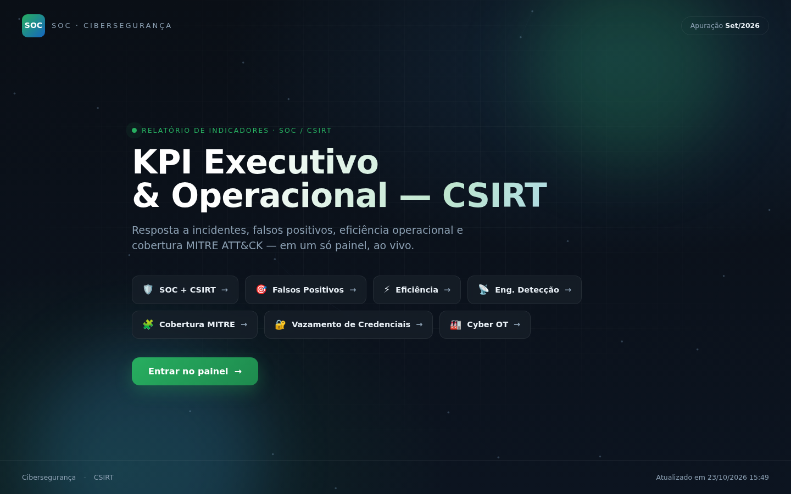
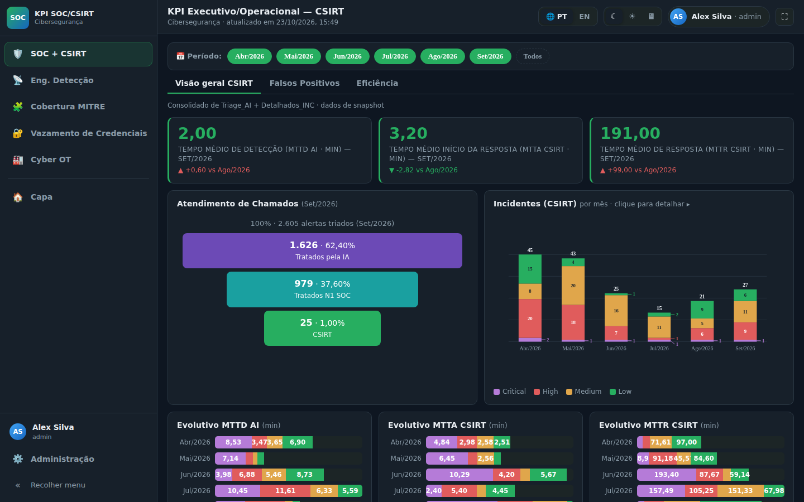
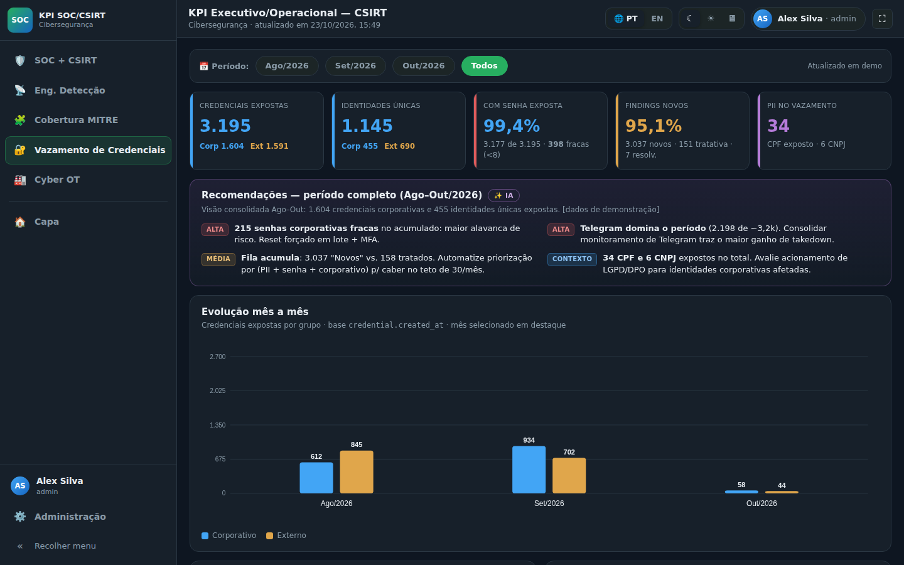
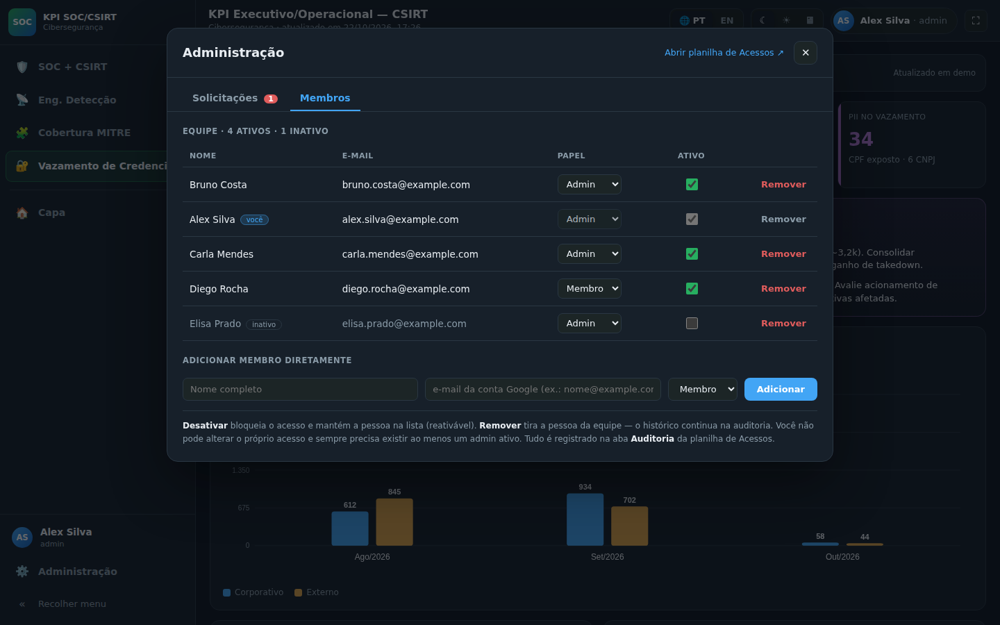
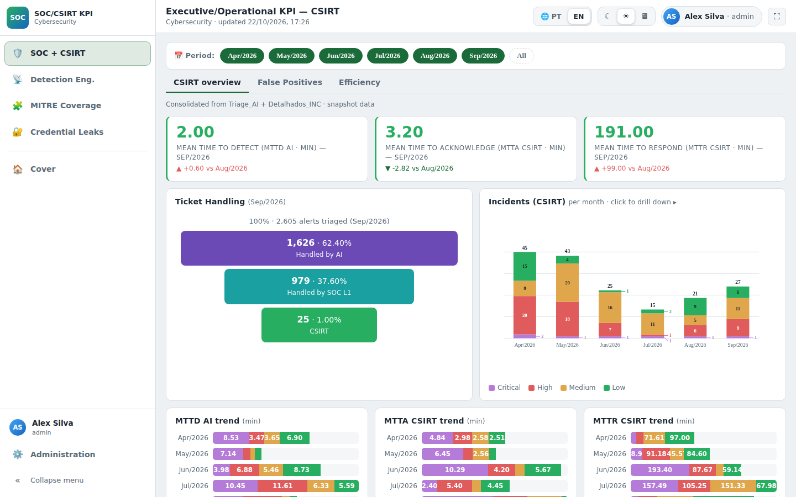
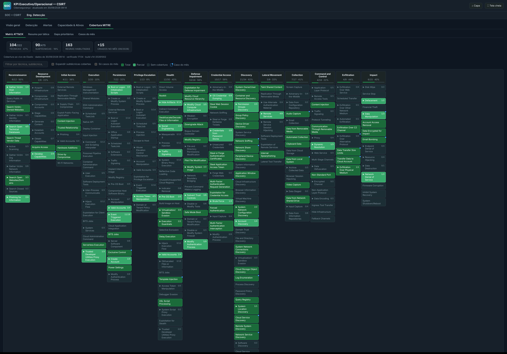

# SOC/CSIRT KPI & MITRE ATT&CK Coverage Dashboard

Painel **executivo/operacional de SOC/CSIRT** servido como **Google Apps Script Web App**. Reúne, em um único link:

- **SOC + CSIRT** — KPIs de resposta a incidentes (MTTD, MTTA, MTTR), funil de atendimento (IA → N1 → CSIRT), incidentes por mês/severidade com drill-down, Falsos Positivos, Eficiência, evolutivos, termômetros de SLA e pontos-chave/atenção gerados automaticamente.
- **Eng. Detecção** — KPIs operacionais de SIEM, alertas, capacidade/ativos.
- **Cobertura MITRE ATT&CK** — ao vivo do Elastic Security (matriz, resumo por tática, gaps, casos do mês).
- **Vazamento de Credenciais** — credenciais expostas (Digital Risk Protection) lidas do data stream do Elastic, separadas em Corporativo × Externo, com recomendações por mês.

Capa de apresentação, menu lateral expansível, **PT | EN**, tema **escuro | claro | sistema**, usuário logado com foto do Google Workspace e **gestão de acesso com aprovação** (portal + e-mail, com auditoria).

> Stack: Google Apps Script (HtmlService, CacheService, PropertiesService, MailApp, LockService, SpreadsheetApp, People API) · Elastic Security Detection Engine API (Kibana) · Elasticsearch `_search` · Google Sheets · MITRE ATT&CK Enterprise v19.1 (15 táticas).

## Telas


*Capa de apresentação com menu interativo — cada item abre direto a seção correspondente.*


*Menu lateral expansível, atalhos de idioma/tema no topo e usuário logado. Aba SOC + CSIRT com rótulos por severidade no gráfico de incidentes.*


*Vazamento de Credenciais — KPIs Corporativo × Externo, recomendações por mês, evolução, fonte do vazamento, família de stealer e status dos findings.*


*Administração — Solicitações (aprovar/negar) e Membros (papel, ativo, remover, adicionar).*


*Mesmo painel em tema claro e inglês.*


*Cobertura MITRE — 15 táticas, técnicas coloridas por cobertura, casos do mês destacados.*

> Imagens ilustrativas com dados fictícios.

---

## Sumário

- [Arquitetura](#arquitetura)
- [Navegação](#navegação)
- [Funcionalidades](#funcionalidades)
- [Métricas (definições)](#métricas-definições)
- [Estrutura do projeto](#estrutura-do-projeto)
- [Pré-requisitos](#pré-requisitos)
- [Configuração](#configuração)
- [Gestão de acesso](#gestão-de-acesso)
- [Idioma e tema](#idioma-e-tema)
- [Diagnóstico](#diagnóstico)
- [Cache versionado](#cache-versionado)
- [Modelo de dados](#modelo-de-dados)
- [Operação e manutenção](#operação-e-manutenção)
- [Segurança](#segurança)
- [Licença](#licença)

---

## Arquitetura

```
                     ┌────────────────────────────────────────────────────┐
                     │                 Google Apps Script                  │
   Navegador  ──►    │  doGet() ──► HtmlService (Index.html)               │
   (/exec)           │     │                                               │
                     │     ├─ getCsirt()        ─► SpreadsheetApp ─────────┼──► Triage_AI + Detalhados_INC
                     │     ├─ getOperational()  ─► SpreadsheetApp ─────────┼──► Gestão de SIEM
                     │     ├─ getCoverage()     ─► Kibana Detection Engine ┼──► Elastic Security
                     │     ├─ getResonant()     ─► Elasticsearch _search ──┼──► data stream de credenciais
                     │     ├─ getSession()      ─► People API (diretório) ─┼──► Google Workspace
                     │     └─ admin*()          ─► SpreadsheetApp ─────────┼──► planilha "Acessos"
                     │  CacheService (chunked) + gatilhos de tempo          │
                     └────────────────────────────────────────────────────┘
```

- **Execução como o proprietário** (`USER_DEPLOYING`): credenciais (API key do Elastic) e acesso às planilhas ficam centralizados no dono do script; os visitantes recebem apenas o HTML.
- **Cache + gatilhos**: cada visita lê o cache; gatilhos reaquecem em background.
- **Snapshot embutido**: as abas CSIRT e Vazamento de Credenciais renderizam na hora a partir de um snapshot e trocam para os dados ao vivo quando o servidor responde.

## Navegação

Menu lateral (recolhe para só ícones):

| Item | Conteúdo |
|---|---|
| **SOC + CSIRT** | Visão geral · Falsos Positivos · Eficiência (seletor de período multi-mês próprio). |
| **Eng. Detecção** | Visão geral · Detecção · Alertas · Capacidade & Ativos. |
| **Cobertura MITRE** | Matriz ATT&CK · Resumo por tática · Gaps prioritários · Casos do mês. |
| **Vazamento de Credenciais** | Seletor Ago/Set/Out/Todos; Corporativo × Externo. |
| **Capa** | Volta à capa de apresentação. |
| **Administração** | Só para Admin: Solicitações e Membros. |

## Funcionalidades

**SOC + CSIRT**
- KPIs **MTTD (AI) · MTTA · MTTR** com variação vs mês anterior.
- **Funil de atendimento** de um único mês (o mais recente selecionado).
- **Incidentes por mês × severidade** com rótulo em cada segmento (chamada lateral para faixas finas) e **drill-down** por Vetor, Plataforma, Taxonomia, Tipo e casos de uso que mais cresceram.
- **Falsos Positivos**: taxa de FP, precisão, FP tratados pela IA, horas poupadas, FP × TP, ranking por tecnologia, top regras, heatmap.
- **Eficiência**: impacto real, precisão por tecnologia, decomposição do tempo, aderência ao SLA, carga dia × hora, Ameaça vs Conformidade.

**Vazamento de Credenciais**
- Lê o data stream do Elastic com uma única `_search` com agregações (`date_histogram` mensal × `filters` Corporativo/Externo, `cardinality` de identidades, força de senha, PII, fonte, família de stealer, status do finding).
- **Corporativo** = domínios da organização (exceto a loja online); **Externo** = demais domínios.
- Card de **recomendações por mês** (PT e EN).

**Plataforma**
- **Capa de apresentação** com menu interativo.
- **Menu lateral** expansível; preferência lembrada no navegador.
- **Usuário logado** com nome e foto do diretório (People API) — cai nas iniciais se a foto não estiver disponível.
- **PT | EN** e **tema escuro | claro | sistema**, salvos no cadastro da pessoa.
- **Gestão de acesso** por planilha, com papéis, aprovação e auditoria.

## Métricas (definições)

| Métrica | Fonte | Cálculo |
|---|---|---|
| **MTTD AI** | Triage_AI, coluna `MTTA` | Tempo do offense iniciado → criado/detectado pela IA (min). |
| **MTTA CSIRT** | Detalhados_INC, coluna `mtta` | Tempo até início da resposta (min). |
| **MTTR CSIRT** | Detalhados_INC, coluna `mttr` | Tempo total de resposta (min). |
| **Funil** | Triage_AI | Total = linhas; IA = `Human Review?` falso; N1 = `Human Review?` verdadeiro; CSIRT = nº de incidentes. |
| **Incidentes** | Detalhados_INC | Linhas com severidade válida, por mês × severidade. |
| **Credenciais expostas** | data stream de credenciais | Mês por `credential.created_at`; identidades únicas = `cardinality(user.email)`; senha fraca = `password_length < 8`. |

## Estrutura do projeto

```
.
├── Code.gs            # Backend: Elastic, planilhas, cobertura ATT&CK, credenciais, acesso, aprovação, sessão
├── Index.html         # Frontend: SPA (vira "Index" dentro do Apps Script)
├── appsscript.json    # Manifesto: escopos OAuth, People API, config do web app
└── docs/              # Screenshots (dados fictícios)
```

No editor do Apps Script devem existir: `Code.gs`, um HTML chamado `Index` e o manifesto `appsscript.json` (visível em *Configurações do projeto → Mostrar arquivo de manifesto*).

## Pré-requisitos

- Google Workspace (deploy restrito ao domínio).
- API key do Elastic com leitura das regras de detecção (MITRE) e `read` no data stream de credenciais (Vazamento de Credenciais).
- **Planilhas Google nativas** (não `.xlsx`) com as abas do modelo de dados.

## Configuração

### 1. Propriedades do script

`Configurações do projeto → Propriedades do script`:

| Chave | Exemplo | Descrição |
|---|---|---|
| `KIBANA_URL` | `https://kibana.example.com:5601` | Base do Kibana, sem barra final. |
| `ES_API_KEY` | `<base64 de id:api_key>` | API key do Elastic (valor `encoded`). |
| `ES_URL` | `https://es.example.com:9200` | Endpoint do Elasticsearch para `_search`. Opcional no Elastic Cloud: derivado do `KIBANA_URL` trocando `.kb.` por `.es.`. |
| `KIBANA_SPACE` | `default` | Space do Kibana (opcional). |
| `SHEET_ID` | `1AbC...` | Planilha "Gestão de SIEM". |
| `SHEET_TRIAGE_ID` | `1DeF...` | Planilha **Triage_AI_Consolidado**. |
| `SHEET_DETALHADO_ID` | `1GhI...` | Planilha **Detalhados_INC_Consolidado**. |
| `ACCESS_SHEET_ID` | `1JkL...` | Planilha de Acessos. **Criada automaticamente** pelo `setupAcessos` se ausente. |
| `ALLOWED_GROUP` | `soc-panel@example.com` | Grupo com acesso (opcional, soma aos membros). |
| `ALLOWED_EMAILS` | `a@example.com,b@example.com` | Lista legada; usada na migração e mantida em sincronia com os membros ativos. |
| `APPROVER_EMAILS` | `lead@example.com` | Legado: vira Admin na migração. |
| `ACCESS_MODE` | `legacy` | Força a regra antiga (lista/grupo) — válvula de escape. |

> Propriedades são lidas em **runtime** — mudar valores **não** exige nova implantação.

### 2. Manifesto

`appsscript.json` traz `executeAs: USER_DEPLOYING`, `access: DOMAIN`, o serviço avançado **People API** e os escopos `spreadsheets`, `script.external_request`, `userinfo.email`, `userinfo.profile`, `script.scriptapp`, `groups`, `script.send_mail`, `directory.readonly`. Se o seu projeto já tem outros serviços avançados (ex.: Drive), **mescle** em vez de substituir.

### 3. Autorização e planilha de Acessos

No editor, rode **`setupAcessos`** uma vez: autoriza os escopos, cria a planilha de Acessos, migra a lista atual e mostra no log os membros, os admins e o status da foto.

### 4. Implantação

`Implantar → Nova implantação → App da Web` (uma vez): **Executar como: Eu**, **Quem tem acesso: Qualquer pessoa na organização**.
Depois, para publicar mudanças: **Gerenciar implantações → Editar → Nova versão** (não crie novas implantações).

### 5. Gatilhos de atualização

| Função | Frequência |
|---|---|
| `refreshCsirt` | a cada 2 h |
| `refreshOperational` | a cada 2 h |
| `refreshCache` (MITRE) | a cada 1–6 h |
| `refreshResonant` (credenciais) | a cada 2–6 h |

## Gestão de acesso

- **Fonte de verdade:** planilha "Acessos" — aba **Membros** (`email, nome, papel, ativo, idioma, tema, criado_em, criado_por, atualizado_em`) e aba **Auditoria** (`data_hora, ator, acao, alvo, detalhe`).
- **Papéis:** **Admin** vê a Administração e aprova pedidos; **Membro** vê os dashboards.
- **Migração:** na primeira execução, quem está em `ALLOWED_EMAILS` vira membro ativo; o dono e os aprovadores viram Admin.
- **Regras:** ninguém altera o próprio acesso; sempre existe ao menos um Admin ativo; **Desativar** bloqueia e mantém na lista; **Remover** tira da equipe (histórico fica na auditoria).
- **E-mail principal:** o Google informa o e-mail principal da conta no login. Ao adicionar, o portal grava o principal (consulta ao diretório) e reconhece cadastros antigos feitos por alias.
- **Compatibilidade:** `ALLOWED_EMAILS` é mantido igual aos membros ativos (implantações antigas e fallback continuam corretos). Se a planilha ficar indisponível, o portal usa a regra antiga automaticamente.
- **Solicitação de acesso:** quem é barrado pede acesso com justificativa; os Admins recebem e-mail com **Aprovar/Negar** e também veem o pedido em **Solicitações**. Quem decidir primeiro resolve.

> A planilha de Acessos controla quem entra: compartilhe para edição apenas com Admins do portal.

## Idioma e tema

- Atalhos no topo: **🌐 PT | EN** e **☾ ☀︎ 🖥** (escuro, claro, sistema). Salvos no navegador e no cadastro da pessoa.
- Tradução por dicionário de modelos aplicada ao DOM (textos, `title`, `placeholder`, `aria-label`), com conversão de números (`1.234,5` → `1,234.5`) e meses (`Set/2026` → `Sep/2026`). Dados das fontes (nomes de regras, técnicas, plataformas) não são traduzidos.

## Diagnóstico

| Ferramenta | Uso |
|---|---|
| `…/exec?whoami=1` | E-mail que o app enxerga, versão do código, cadastro, aliases no diretório, status da People API. |
| `debugAcesso('email')` | Por que a pessoa entra ou não (cadastro exato, aliases, parecidos na planilha). |
| `debugFoto('email')` | Origem da foto (diretório / perfil da conta) e resultado do download. |
| `debugResonant()` | Valida a consulta ao data stream de credenciais. |
| `debugMonth()` | Regras do mês na cobertura MITRE. |

## Cache versionado

O resultado carrega `CODE_VERSION` e as chaves de cache derivam dela; o leitor só aceita cache da versão corrente.

## Modelo de dados

| Fonte | Campos-chave |
|---|---|
| **Triage_AI_Consolidado** | `Competência` · `Mês_Ref` · `Severidade` · `AI Veredict` · `Human Review?` · `MTTA` · `Offense started at` · `Criado` · `Resolvido` |
| **Detalhados_INC_Consolidado** | `Competência` · `Mês_Ref` · `Severidade` · `mtta` · `mttr` · `offense id` · `platforma` |
| **Gestão de SIEM** | abas `Elastic`, `Alertas`, `Origem do Log`, `Inventário SIEM`, `Licenciamento`, `Highlights`, … |
| **Data stream de credenciais** | `credential.created_at`, `user.email`, `user.domain`, `credential.has_password`, `credential.password_length`, `credential.national_id.*`, `resonant.source`, `resonant.stealer_family`, `resonant.finding.status` |

## Operação e manutenção

- Mudou `Code.gs`/`Index`/manifesto → **Nova versão**. Mudou só propriedade → aplica em runtime.
- Mantenha **uma única implantação** (arquive as demais).
- Atualizar catálogo ATT&CK → regenerar o bloco `CATALOG` no `Code.gs` a partir do STIX oficial.

## Segurança

- Credenciais e IDs ficam **apenas** nas Propriedades do script.
- Execução como proprietário: visitantes não recebem token nem acessam planilhas/Elastic.
- Operações administrativas exigem Admin ativo no servidor; aprovação por e-mail exige identidade de Admin + token de uso único, sob lock.
- O token do dono só é enviado ao baixar fotos de hosts de imagem do Google.
- Deploy restrito ao domínio (`access: DOMAIN`).

## Licença

MIT. MITRE ATT&CK® é marca da The MITRE Corporation.
